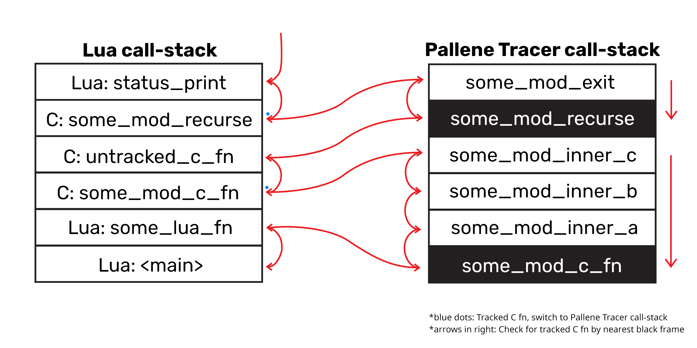

<h1 align="center">The Pallene Tracer</h1>
<p align="center">This document records the specifications of Pallene Tracer and its API</p>
<p>
<div align= "center">
    <a href= "#1-overview">Overview</a>
    •
    <a href= "#2-implementation">Implementation</a>
    •
    <a href= "#3-mechanism">Mechanism</a>
    •
    <a href= "#4-api">API</a>
</div>

## 1. Overview

The Lua call-stack is great for tracing and debugging Lua calls. But when it comes to tracing C function calls, the scenario is different. The builtin Lua call-stack has no features regarding storing line number information for C call-frames and traces of C functions called from another C function is entirely missing from the Lua call-stack.

Pallene Tracer aims to fix that issue without patching the Lua interpreter. This is done so by maintaining a separate call-stack of our own, the **`Pallene Tracer call-stack`**.

This section provides a high-level overview on how Pallene Tracer works. For precise details regarding how it works in execution level, please refer to the <a href="#2-implementation">Implementation</a> section.

 > **Note:** These assumptions are enforced to reduce redundancy and best reading experience.
### \*Noteworthy Assumptions:
 - Any non-explicit mention of **call-stack** should be thought of as the **Pallene Tracer call-stack**.
 - Standard C functions distinct from Lua C function (`lua_CFunction`) signature are referred to as Generic/Normal C functions.
 - C function calls having traces in both Lua and Pallene Tracer call-stack are referred to as **Lua interface frames** (or black frames), generally the Lua C function calls.
 - C function calls having traces only in call-stack are referred to as **C interface frames** (or white frames). These are generic C functions only traced by Pallene Tracer.
 - The sign `->` is contextualized. If used against functions in such convention: `caller() -> callee()` (e.g. `a() -> b()`), it would denote `caller` function has called the `callee` function. Here the sign should be read as **_called_**, e.g. `a()` called `b()`.\
 \
 If used against environments in such convention: `Caller enviornment -> Callee environment`, it would denote situations when any function of caller environment is calling any function from callee environment such that we were to do something with this information. E.g. `Lua -> C` would mean situation when any Lua function is calling any C function. Here the sign should be read as **_to_**, e.g. Lua to C or C to C.
 - Untracked frames are referred to frames present in Lua call-stack but absent in call-stack. Any mention of "**Tracked frame**" is synonymous to Lua interface frame. In simple terms, any Lua C call-frame traced by Pallene Tracer is a Tracked frame. It is untracked otherwise.
### 1.1 How it works

In **`pallene-tracer`**, there a separate call-stack maintaining only C call-frames. The call-stack is used synchronously alongside with the Lua call-stack to generate a better stack-trace consisting of both Lua and C/Pallene function traces.

To understand how it all fits, let's assume there is a Lua C module named `some_mod` with Pallene Tracer tracebacks enabled. A Lua `main.lua` script uses that module.

In the module and script combined:  
 - Six functions in `some_mod` module: `some_mod_c_fn()`, `some_mod_inner_a()`, `some_mod_inner_b()`, `some_mod_inner_c()`, `some_mod_recurse()` and  `some_mod_exit()`
 - Two functions in `main.lua` script: `some_lua_fn()` and `status_print()`
 - One untracked C function: `untracked_c_fn()`

The module and function names are obvious for simplicity sake. Suppose, from a high-level perspective the function calls look like this:

`Lua <main> chunk` &nbsp;&nbsp;&nbsp;&nbsp;&nbsp; -> &nbsp; `some_lua_fn()` &nbsp;&nbsp;&nbsp;&nbsp;&nbsp;&nbsp;&nbsp;&nbsp;&nbsp; ->\
`some_mod_c_fn()` &nbsp;&nbsp;&nbsp;&nbsp;&nbsp;&nbsp;&nbsp; -> &nbsp; `some_mod_inner_a()` ->\
`some_mod_inner_b()` &nbsp; -> &nbsp; `some_mod_inner_c()` ->\
`untracked_c_fn()` &nbsp;&nbsp;&nbsp;&nbsp;&nbsp; -> &nbsp; `some_mod_recurse()` ->\
`some_mod_exit()` &nbsp;&nbsp;&nbsp;&nbsp;&nbsp;&nbsp;&nbsp; -> &nbsp; `status_print()`

Say a runtime error has been triggered in `status_print()` which needs to display the stack-trace. The Lua call-stack would look alike to the left stack of _Figure 1_. Using that call-stack, Lua would generate error message as following: 

> **Note:** The line numbers and module filename are assumed.
```
main.lua:69: Some random error to concern ourselves
stack traceback:
	main.lua:69: in function 'status_print'
	[C]: in function 'some_mod.some_mod_recurse'
	[C]: in ?
	[C]: in function 'some_mod.some_mod_c_fn'
	main.lua:37: in function 'some_lua_fn'
	main.lua:113: in main chunk
	[C]: in ?
```
The traceback above is far from great. The C calls are missing line number information and some are missing function name. Some C call traces are downright missing.

**But**, by integrating Pallene Tracer into `some_mod` module and using the `pt-lua` on `main.lua`, something like this is achievable: 
```
Runtime error: main.lua:69: Some random error to concern ourselves
Stack traceback:
    main.lua:69: in function 'status_print'
    some_mod.c:11: in function 'some_mod_exit'
    some_mod.c:8: in function 'some_mod_recurse'
    C: in function 'untracked_c_fn'
    some_mod.c:47: in function 'some_mod_inner_c'
    some_mod.c:33: in function 'some_mod_inner_b'
    some_mod.c:21: in function 'some_mod_inner_a'
    some_mod.c:18: in function 'some_mod_c_fn'
    main.lua:37: in function 'some_lua_fn'
    main.lua:113: in <main>
    C: in function 'xpcall'
    C: in function '<?>'
```

Which is more informative and clean. A data-structure is required to store the line number and function name information ourselves due to Luas lack of feature for storing relevant information regarding C call-frames. That is where Pallene Tracer self-maintained call-stack comes into play.


<p align="center"><small>Figure 1: Synchronous relation between Lua and Pallene Tracer call-stack</small></p>

> **Note:** Black and white frames are concepts solely bounded to Pallene Tracer and Pallene Tracer call-stack regardless of illustrations. The black frames are also illustrated in Lua call-stack primarily for better intuition. 

In the Figure above, Lua and Pallene Tracer call-stack can be seen side by side with call-stack having some extra frames absent in Lua call-stack. There are some boxes (frames) filled with black and also some red lines.

Pallene Tracer call-stack is synchronous to Lua call-stack, meaning that it copes up with Lua call-stack by storing common frames alongside with extra frames traced separately. The black boxes seen in the Figure are black frames (Lua interface frames), the red lines denote connection between Lua C frames and black frames between Lua and Pallene Tracer call-stack. 

The reason behind having two types of frames is because when our Pallene Tracers traceback function starts backtracing, it needs to utilize both of the call-stacks. The black frames act as _hints_ to the traceback function to switch back to Lua call-stack.

All the frames in call-stack are C frames storing information like function name, filename where the function belongs to and the current executing instruction line number. The line number is updated manually by the function in question prior to calling another function or invoking a runtime error.

### 1.2 Working Principle of Traceback Function

The builtin Lua traceback function (`luaL_traceback`) will not take advantage of the separate self-maintained call-stack that Pallene Tracer have. Therefore, an explicit debug traceback function is used to display the stack-trace. This debug traceback function will mostly be used by `pt-lua`, Pallene Tracers custom [Lua frontend](#26-the-pallene-tracer-lua-frontend). The function, defined as `pallene_tracer_errhandler` Lua global, also can be used against `xpcall()` to generate stack-trace as well.

Below is a Figure mostly resembling the figure prior but with curvy red lines, blue dots and some red straight lines at the right.



<p align="center"><small>Figure 2: Working mechanism of Pallene Tracer traceback function</small></p>

Unlike the builtin Lua traceback function, Pallene Tracer traceback function needs to deal with two separate but synchronous stacks simultaneously. But here's the elephant in the room. During backtrace how to know which call-stack to use and when?

To solve this problem, the concept of black and white frames is introduced. Frames which are common in both Pallene Tracer and Lua call-stack are black frames or Lua interface frames. The other frames in Pallene Tracer call-stack are referred to as white frames or C interface frames.

> **Intuition:** If a Lua C function compatible with Pallene Tracer gets called, it would create a call-frame in both of the call-stacks. A call-frame would be created in Lua call-stack when the function is invoked (by Lua script or any variant of `lua_call`), then a black call-frame would be created in Pallene Tracer call-stack when the function executes. Any Pallene Tracer compatible normal C functions called onwards will create white call-frames only in call-stack during execution.

The traceback mechanism is rather simple. There are two stack pointers pointing at the topmost frame of the respective call-stack. Backtracing shall begin with Lua call-stack. Lua call-frames are printed if encountered. But upon encountering a C call-frame, **_black frame probing_** is done to check traces of the encountered frame in call-stack. If the probing is successful, the frame is tracked.

> **Note:** **_Black frame probing_** is the checking mechanism of a C call-frame of Lua call-stack having any traces in Pallene Tracer call-stack. It is generally the nearest Lua interface frame relative to current stack top. The mechanism is performed in a separate iteration. The black frame probing is denoted by the red straight lines at right of _Figure 2_ facing downwards. In simpler terms, black frame probing checks whether a C function is Tracked.

If the the C call-frame turns out to be tracked, immediate switch to Pallene Tracer call-stack takes place. Stack iteration starts from current stack top denoted by the stack pointer. White frames are printed upon encounter. In case of a black frame, it is printed and call-stack is reswitched to Lua call-stack.

But if the frame turns out to be untracked, it is printed as a simple C function without any line number information and next frame is processed. But the function name is printed if found any by name deduction, a technique of finding function name by searching Lua global table.

When the traceback function is in action, it would seem like the a single pointer is hopping between frames in both call-stacks, denoted by the curvy lines in the middle of _Figure 2_. For every C frame found in Lua call-stack, black frame probing is done. A blue dot can be perceived near the C call-frames of Lua call-stack denoting tracked C frames after successful probes and a switch to Pallene Tracer call-stack.
### 1.3 The Untracked Frames

As aforementioned, upon encountering a C call-frame in Lua call stack, immediately probing is done to check whether the frame is "tracked". During the process, the nearest black frame is approached in Pallene Tracer call-stack to perform a match. If the match fails, the frame in question is "untracked".

This happens when a Lua C function is not traced by Pallene Tracer at runtime, resulting the call only creating a call-frame in Lua call-stack.

> **Clarification:** For untracked C frames, the black frame getting compared with in call-stack may represent some other C call-frame in Lua call-stack, which may get encountered in the future during backtrace. As illustrated in _Figure 1_, every black frame of call-stack is connected to a frame in Lua call-stack.

## 2. Implementation

There are five components to Pallene Tracer making all the magic happen. Four functions in `ptracer.h` (abstracted by macros) and a tool, [`pt-lua`](#26-the-pallene-tracer-lua-frontend).

### 2.1 The `ptracer.h` Header

`ptracer.h` is a [STB style](https://github.com/nothings/stb) header which includes implementation code and can be used as a static library. Using the header without any macros would yield a normal header include.

```C
/* Function signatures but no implementation code */
#include <ptracer.h>
```

Using the `PT_IMPLEMENTATION` macro prior to including the header would yield a header include with implementation code.

```C
/* Function signatures and implementation code */
#define PT_IMPLEMENTATION
#include <ptracer.h>
```

Which can be thought of as,

```C
#include <ptracer.h>

/* Function definitions of ptracer.h header */
```

Therefore, it is highly recommended to keep the implementation code to different C translation and include the header normally in other C translations.\

<p align="right"><small><i>mymodule-ptracer.c</i></small></p>

```C
#define PT_IMPLEMENTATION
#include <ptracer.h>

/* Nothing else needs to be done here */
```

<p align="right"><small><i>mymodule-other.c</i></small></p>

```C
/* Now, normally including the header would suffice
 * because we have the implementation code.
 */

#include <ptracer.h>

/* ... OTHER CODE ... */
```

But in case of single source modules, including the header with implementation is fine.

<p align="right"><small><i>single-source-module.c</i></small></p>

```C
#define PT_IMPLEMENTATION
#include <ptracer.h>

/* ... MODULE CODE ... */
```

> **Important Note:** The **`PT_DEBUG`** macro is used to toggle debug mode in Pallene Tracer. Debugging mode is **ON** if the macro is defined.

### 2.2 The Implementation of API Functions

The `ptracer.h` header includes four functions to be integrated to module codebase.

> **Note:** Refer to the <b><a href="#api-functions">API</a></b> section for proper function details, signatures and their respective wrapper macros.

#### I) `pallene_tracer_init`

The Pallene Tracer call-stack is stored in Lua registry, accessible across Pallene Tracer compatible modules sharing same Lua state.

The function checks if the call-stack can be found in the registry. If so, that indicates Pallene Tracer has been initialized beforehand by some other Pallene Tracer compatible module and the call-stack alongside with [to-be-closed finalizer](#24-significance-of-to-be-closed-finalizer-object) object (through Lua value-stack) is returned.

If not so, the call-stack is created. Memory is allocated for two structures, userdatum for `pt_fnstack_t`, which acts like call-frame buffer container and heap allocation for `pt_frame_t` buffer. A `__gc` metamethod is prepared for `pt_frame_t` buffer deallocation. The stack is then stored in Lua registry. The to-be-closed finalizer object is then prepared, stored in registry and pushed onto the Lua value-stack.

The function ensures return of Pallene Tracer call-stack and the finalizer object in Lua stack if debugging mode is enabled. Otherwise `NULL` and `nil` is returned respectively.

This function should be called from module init (`luaopen_*`) functions.

#### II) `pallene_tracer_frameenter`

This inline function pushes a frame onto the Pallene Tracer call-stack. **If** call-stack frame limit is reached, no frames are pushed **but** the frame count is incremented regardless.

#### III) `pallene_tracer_frameexit`

This inline function removes the topmost frame from call-stack by decrementing the frame count, if frame count is greater than 0.

#### IV) `pallene_tracer_setline`

This inline function sets line number to the topmost frame in the call-stack, if any frame exists.

### 2.3 Implementation Overview on Working Principle

In implementation sense, Pallene Tracer works slightly differently. The noticeable difference is the Black Frame is dissected into a White and a Black frame structure-wise.

In the high-level overview, the black frames store not only frame information such as function name, line numbers but also stores something which can be matched with Lua call-stack C frames with during black frame probing. Generally, that "something" is **`lua_CFunction` pointer** and "match" is **pointer match**. Therefore, not only a `lua_CFunction` pointer but also frame-related information needs to be stored in Black frame structure, where the same frame-related information can be stored in the White frame structure. So, to reduce data-structure redundancy, in call-stack Black frame structure stores only the `lua_CFunction` pointer followed by a successive white frame storing the frame-related information for the Black frame.

Alternatively, Lua C functions are normal C functions if not looked from Luas perspective. Thus, it would make sense to give them White frames and then Black frames to dictate Lua C function.

To ensure traces in call-stack, a frame should be pushed by subsequently calling the **`frameenter`** function. Even though there is only a single `pallene_tracer_frameenter` function, macros are designed to abstract it away differentiating between Lua and C interface functions. Frames should be popped by calling the **`frameexit`** function respectively, which is also abstracted away by macros. Noteworthy to mention, Lua interface functions do not need to call `frameexit`.

```C
/* ... OTHER HEADER FILES ... */

#define PT_IMPLEMENTATION
#define <ptracer.h>

static pt_fnstack_t *fnstack;

/* ---- A GENERIC C FUNCTION ---- */
int mymodule_some_c_func(lua_State *L) {
    /* Only white frame. */
    PALLENE_TRACER_GENERIC_C_FRAMEENTER(fnstack, c_frame);

    /* ... CODE ... */

    PALLENE_TRACER_FRAMEEXIT(fnstack);
    return something;
}

/* ---- A LUA C FUNCTION ---- */
int mymodule_some_func(lua_State *L) {
    /* The Black frame, holding the function pointer. */
    PALLENE_TRACER_LUA_FRAMEENTER(L, fnstack, (void *) mymodule_some_func, 
        index_where_finalizer_object_is_in_value_stack, lua_frame);
    /* Successive White frame holding frame information. */
    PALLENE_TRACER_GENERIC_C_FRAMEENTER(fnstack, c_frame);

    /* Setting Line number to current call-frame prior to calling a function */
    PALLENE_TRACER_GENERIC_C_SETLINE(fnstack);
    lua_pushinteger(L, mymodule_some_c_func(L));
    return 1;
}

int luaopen_mymodule(lua_State *L) {
    /* Finalizer object is pushed into Lua value-stack. */
    fnstack = pallene_tracer_init(L);

    /* ... MODULE CODE TO ENSURE EVERY MDOULE FUNCTION HAVE ACCESS TO
           CALL-STACK AND FINALIZER OBJECT ... */
    /* REFER TO MECHANISM SECTION TO KNOW MORE */
}
```
Generally, working with Pallene Tracer is not a cumbersome experience, thanks to macro utilization. The code above is deliberately verbose for explanatory purposes.

In the code above, black frame is pushed alongside with a successive white frame hereafter in Lua C function. The black frame works like a marker in Pallene Tracer call-stack. For generic C function, only white frame is pushed.

The **traceback function** works similarly mentioned in overview. As aforementioned, black frames are dissected and another white frame bears the frame information of that particular black frame. Hence, in implementation sense, the significance of black frame is for probing and stack switch. The traceback function works as following: 

```
while each frame in Lua call-stack:
    if frame is C frame: 
        # Black frame probing
        black_frame = nil
        while call-stack current_frame is not black frame:  # No statements
        black_frame = current_frame

        # Frame is tracked
        if pointer match between frame and black_frame: 
            while call-stack current_frame is not black frame:
                # Black frame will also get printed here
                print white frames
        else print untracked C frame
    else print Lua frame
```

### 2.4 Significance of To-be-closed Finalizer Object

A call to FRAMEENTER pushes a frame onto Pallene Tracer call-stack, a consecutive call to FRAMEEXIT pops the frame from the stack. But, in case of a runtime error, function execution stops before FRAMEEXIT call is reached in any of the functions. Hence, after the traceback has been done and error has been reported, the pushed frames stay in the stack.

It is generally not a problem if the Lua interpreter exits after the exception as interpreter execution terminates. But if the error is caught with `pcall()` and its derivatives, the interpreter continues. At this point when Pallene Tracer tries to reuse call-stack for later function calls, the call-stack tend to get corrupted because of the previous uncleaned call-frames stack up, causing memory errors and in worst case scenario, crash.

> **Note:** To-be-closed metamethod (`__close`) is only available in Lua 5.4 and later.

The to-be-closed object is an object with `__close` metamethod. The metamethod is called whenever the object goes **_out of scope_** and is **closed** with `lua_toclose()`. Here, out of scope happens when respecting functions execution is completed or any error is encountered. Therefore, using this to-be-closed object, the problem of Pallene Tracer call-stack corruption can be fixed.

The to-be-closed finalizer object is a table with a metatable holding the `__close` metamethod. The metamethod is called "finalizer" because it releases the call-frames. The table object holding the "finalizer" metamethod is the finalizer object, which needs to closed by calling `lua_toclose()`. Luckily, it is done so by the API macros.

> **Clarification:** The finalizer function/metamethod is responsible for popping the black frame from call-stack as well as all the white frames came after it. As the metamethod automatically gets called as soon as function execution completes, the representing black frame is popped from call-stack. Thus, it is unnecessary to call any form of FRAMEEXIT in Lua interface functions.

### 2.5 Working Principle of To-be-closed Finalizer Metamethod

Call to generic C functions are not done with `lua_call()` and it's derivatives. Hence, all C interface functions share the value-stack of last Lua interface function. There is a single finalizer object instance in every Lua interface value-stack, responsible for popping the representing black frame of respecting Lua C function and all the white frames coming after it. The object usually stays at the very bottom of the stack, mostly safe from unintentional popping from generic C functions.

The finalizer function/metamethod works as follows: 
```
while no black frame:
    pop frame

pop black frame
```

### 2.6 The Pallene Tracer Lua Frontend

Pallene Tracer has a tool up it's sleeve, a Lua frontend named **`pt-lua`**.

A separate call-stack traceback function is needed to utilize our Pallene Tracer call-stack alongside with Lua call-stack. `pt-lua` is a Lua interpreter frontend (custom version of `lua.c` file per-se) with Pallene Tracer custom call-stack traceback function being the default one replacing `luaL_traceback`.

Users are hereby implored to use `pt-lua` instead of `lua` command while working with Pallene Tracer compatible modules and languages, e.g. Pallene.

> **Important Note:** Pallene Tracers custom error handler is available through `pallene_tracer_errhandler` global to be used against `xpcall()`.

## 3. Mechanism

There are some mechanism or techniques to adopt Pallene Tracer to modules, increasing development experience.

As aforementioned, all the C functions need to have access to Pallene Tracer call-stack and Lua interface functions need to have access to to-be-closed finalizer object. From Lua or C environment, only Lua interface functions can be invoked and generic C functions share the Lua state of last Lua interface function call.

A great way to pass call-stack and finalizer object would be through Upvalues to Lua interface functions, evidently making them Lua C closures. The C interface function also have access to call-stack because same Lua state is shared. The Pallene Tracer call-stack can be shared with interface function through C global as well, but in such way flexibility of supporting multiple Lua state is sacrificed.

### 3.1 Working with Macros

While using Pallene Tracer, utilizing macros are crucial. Pallene Tracer macros  are designed to be flexible, generic and should be wrapped with Users defined macros to unleash its full potential.

> **Note:** Go to the [Macros](#43-api-macros) subsection of API section to learn what each API macro does.

If working with multi-source modules, it is recommended to dedicate a header file for macro definitions. For single source modules, it is a good idea to define the macros at the beginning of translation. An example header would be:

<p align="right"><small><i>ptracer-macros.h</i></small></p>

```C
#ifndef PTRACER_MACROS_H
#define PTRACER_MACROS_H

/* User specific macros when Pallene Tracer debug mode is enabled. */
#ifdef PT_DEBUG
#define MODULE_GET_FNSTACK                       \
    pt_fnstack_t *fnstack = lua_touserdata(L,    \
        lua_upvalueindex(N));  // If `fnstack` is passed as Nth upvalue

#else
#define MODULE_GET_FNSTACK  // Release mode, we do nothing
#endif // PT_DEBUG

/* ---------------- C INTERFACE ---------------- */

#define MODULE_C_FRAMEENTER()                              \
    MODULE_GET_FNSTACK;                                    \
    PALLENE_TRACER_GENERIC_C_FRAMEENTER(fnstack, _frame_c)

#define MODULE_C_SETLINE()                                 \
    PALLENE_TRACER_GENERIC_C_SETLINE(fnstack)

#define MODULE_C_FRAMEEXIT()                               \
    PALLENE_TRACER_FRAMEEXIT(fnstack)

/* ---------------- C INTERFACE END ---------------- */

/* ---------------- LUA INERFACE ---------------- */

// Finalizer object upvalue at 
#define MODULE_LUA_FRAMEENTER(fnptr)                       \
    MODULE_GET_FNSTACK;                                    \
    PALLENE_TRACER_LUA_FRAMEENTER(L, fnstack, fnptr,       \
        lua_upvalueindex(N + 1), _frame_lua)               \
    MODULE_C_FRAMEENTER();  // Lua interface functions are also C functions

/* ---------------- LUA INERFACE END ---------------- */

#endif // PTRACER_MACROS_H
```

> **Clarification:** Pallene Tracer macros work if and only if `PT_DEBUG` macro is defined. This macro also can be perceived to define user specific macros when Pallene Tracer debug mode is enabled. If the macro is undefined, Pallene Tracer API macros expand to nothing.

### 3.2 The Dispatch Mechanism

Modules are written following this mechanism solely keeping performance in mind. In this mechanism/framework, the Lua interface function dispatches to a generic C function. In this way, the generic C function can call another module specific function directly without `lua_call()` and it's derivatives. This implementation mechanism is performant when involving lot of function calls in a module as there is no `lua_call()` overhead.

<p align="right"><small><i>dispatch-module.c</i></small></p>

```C
#define PT_IMPLEMENTATION
#include <ptracer.h>

/* User specific macros when Pallene Tracer debug mode is enabled. */
#ifdef PT_DEBUG
#define MODULE_GET_FNSTACK                          \
    pt_fnstack_t *fnstack = lua_touserdata(L,       \
        lua_upvalueindex(1))

#else
#define MODULE_GET_FNSTACK
#endif // PT_DEBUG

/* ---------------- PALLENE TRACER LUA INERFACE ---------------- */

#define MODULE_LUA_FRAMEENTER(fnptr)                       \
    MODULE_GET_FNSTACK;                                    \
    PALLENE_TRACER_LUA_FRAMEENTER(L, fnstack, fnptr,       \
        lua_upvalueindex(2), _frame)

/* ---------------- PALLENE TRACER LUA INERFACE END ---------------- */

/* ---------------- PALLENE TRACER C INTERFACE ---------------- */

#define MODULE_C_FRAMEENTER()                              \
    MODULE_GET_FNSTACK;                                    \
    PALLENE_TRACER_GENERIC_C_FRAMEENTER(fnstack, _frame)

#define MODULE_C_SETLINE()                                 \
    PALLENE_TRACER_GENERIC_C_SETLINE(fnstack)

#define MODULE_C_FRAMEEXIT()                               \
    PALLENE_TRACER_FRAMEEXIT(fnstack)

/* ---------------- PALLENE TRACER C INTERFACE END ---------------- */

lua_Integer some_dispatch_fn(lua_State *L, lua_Integer some_int) {
    MODULE_C_FRAMEENTER();

    /* ... SOME CODE ... */
    lua_Integer something = 69 * some_int;

    MODULE_C_FRAMEEXIT();
    return something;
}

int some_dispatch_fn_lua(lua_State *L) {
    // It is generally a good idea to store base stack because
    // the finalizer object would be pushed to the stack by the
    // `MODULE_LUA_FRAMEENTER` macro.
    int base = lua_gettop(L);
    // We don't need to create a white frame here becuase we can do
    // it in the dispatchee function.
    MODULE_LUA_FRAMEENTER(some_dispatch_fn);

    if(base < 1) {
	    luaL_error(L, "expected atleast 1 parameter");
    }
    if(!lua_isinteger(L, 1)) {
        luaL_error(L, "expected the first parameter to be an integer");
    }

    // Dispatch to generic C funtion.
    lua_pushinteger(some_dispatch_fn(L, lua_tointeger(L, 1)));

    return 1;
}

int luaopen_dispatch_module(lua_State *L) {
    // `pallene_tracer_init` returns NULL if debug mode is disabled
    // Finalizer object is pushed into the value-stack
    pt_fnstack_t *fnstack = pallene_tracer_init(L);

    lua_newtable(L);
    int table = lua_gettop(L);

    /* ---- some_dispatch_fn ---- */
    lua_pushlightuserdata(L, fnstack);  // Our call-stack
    // The finalizer object is already in value-stack
    lua_pushvalue(L, -3);
    lua_pushcclosure(L, some_dispatch_fn_lua, 2);
    lua_setfield(L, table, "some_dispatch_fn");

    return 1;
}
```

### 3.3 The Singular Mechanism

This is the simplest mechanism followed by most of the Lua modules. In this mechanism, Lua interface function does most of the heavy-lifting, instead of dispatching to a representing generic C function. Writing modules following this mechanism is simple but relinquishes performance, because  `lua_call()` overhead is introduced while calling other module functions.

In singular mechanism, Lua interface functions are treated almost as generic C functions.

<p align="right"><small><i>singular-module.c</i></small></p>

```C
#define PT_IMPLEMENTATION
#include <ptracer.h>

/* User specific macros when Pallene Tracer debug mode is enabled. */
#ifdef PT_DEBUG
#define MODULE_GET_FNSTACK                          \
    lua_pushligthuserdata(L, &stack_key);           \
    lua_gettable(L, LUA_REGISTRYINDEX);             \
    pt_fnstack_t *fnstack = lua_topointer(L, -1);   \
    lua_pop(L, 1)

#else
#define MODULE_GET_FNSTACK
#endif // PT_DEBUG

/* ---------------- PALLENE TRACER C INTERFACE ---------------- */

#define MODULE_C_FRAMEENTER()                              \
    MODULE_GET_FNSTACK;                                    \
    PALLENE_TRACER_GENERIC_C_FRAMEENTER(fnstack, _frame)

#define MODULE_C_SETLINE()                                 \
    PALLENE_TRACER_GENERIC_C_SETLINE(fnstack)

#define MODULE_C_FRAMEEXIT()                               \
    PALLENE_TRACER_FRAMEEXIT(fnstack)

/* ---------------- PALLENE TRACER C INTERFACE END ---------------- */

/* ---------------- PALLENE TRACER LUA INERFACE ---------------- */

#define MODULE_LUA_FRAMEENTER(fnptr)                       \
    MODULE_GET_FNSTACK;                                    \
    lua_pushlightuserdata(L, &finalizer_key);              \
    lua_gettable(L, LUA_REGISTRYINDEX);                    \
    PALLENE_TRACER_LUA_FRAMEENTER(L, fnstack, fnptr,       \
        -1, _frame_lua)                                    \
    MODULE_C_FRAMEENTER()

/* ---------------- PALLENE TRACER LUA INERFACE END ---------------- */

static int stack_key;
static int finalizer_key;

lua_Integer generic_c_fn(lua_State *L, int some_int) {
    MODULE_C_FRAMEENTER();

    /* ... SOME CODE ... */
    lua_Integer something = 88 * some_int;

    MODULE_C_FRAMEEXIT();
    return something;
}

int some_singular_fn(lua_State *L) {
    // It is generally a good idea to store base stack because
    // the finalizer object would be pushed to the stack by the
    // `MODULE_LUA_FRAMEENTER` macro.
    int base = lua_gettop(L);
    // We don't need to create a white frame here becuase we can do
    // it in the dispatchee function.
    MODULE_LUA_FRAMEENTER(some_dispatch_fn);

    if(base < 1) {
	    luaL_error(L, "expected atleast 1 parameter");
    }
    if(!lua_isinteger(L, 1)) {
        luaL_error(L, "expected the first parameter to be an integer");
    }

    /* ... CODE ... */

    MODULE_C_SETLINE();
    lua_Integer result = generic_c_fn(L, lua_tointeger(L, 1));
    lua_pushinteger(L, (result << 2) + 13);

    // Lua interface functions are almost treated as generic C functions.
    MODULE_C_FRAMEEXIT();
    return 1;
}

int luaopen_singular_module(lua_State *L) {
    // `pallene_tracer_init` returns NULL if debug mode is disabled
    // Finalizer object is pushed into the value-stack
    pt_fnstack_t *fnstack = pallene_tracer_init(L);

    // Using Lua registry is another way of supplying the stack
    // and finalizer object.
    // Pallene Tracer call-stack.
    lua_pushlightuserdata(L, &stack_key);
    lua_pushlightuserdata(L, fnstack);
    lua_settable(L, LUA_REGISTRYINDEX); 

    // Finalizer object.
    lua_pushlightuserdata(L, &finalizer_key);
    lua_pushvalue(L, -2);
    lua_settable(L, LUA_REGISTRYINDEX);

    lua_newtable(L);
    int table = lua_gettop(L);

    /* ---- some_singular_function ---- */
    lua_pushcfunction(L, some_singular_fn);
    lua_setfield(L, table, "some_singular_fn");

    return 1;
}
```

In above example, Lua registry is used, which is yet another way to supply the call-stack. But generally, using Upvalues is recommended to ensure maximum performance.

> **Clarification:** Compiling without the `PT_DEBUG` macro will result empty expansion of the macros used in the examples. Therefore, no performance hit will be encountered.

### 3.4 When and Where to use Macros

Regardless of the interface function type, three macros are frequently used: 
1. The `FRAMEENTER` macro(s) should be used at the very beginning of each function.
2. The `FRAMEEXIT` macros should be used before every return statement. **_BUT BE CAREFUL_** to add a FRAMEEXIT at the very end of **_void C interface functions_**. **_IT IS VERY EASY TO MISS._**
3. The use of `SETLINE` macro is tricky. It is generally used to set line numbers to topmost call-frame in call-stack. It should be used prior to calling any function, or triggering any error. But some Lua API functions can trigger runtime errors (e.g. when `nil` value is used against `lua_len`). Using `SETLINE` prior calling these API function is recommended.

> **Tip:** If any garbage line number is encountered (e.g. line number 0 or any line number which does not exist in the function, line number denoting blank line etc.), it is because the `SETLINE` macro is not called properly. Most of the cases, it happens when runtime error is triggered by any of the Lua API functions.

To make setting line easier, some more user specific macros can be enforced: 
```C
#define MODULE_DOSTMT(stmt)   \
MODULE_C_SETLINE();           \
stmt
```

Which then can be used like:
```C
MODULE_DOSTMT(call_some_func(L, parameters));
MODULE_DOSTMT(int n = lua_len(L, -1));
```
## 4. API

This is Pallene Tracer API specification.
### 4.1 Data Structures

Data structure of each frame in call-stack: 
```C
/* What type of frame we are dealing with. */
typedef enum frame_type {
    PALLENE_TRACER_FRAME_TYPE_C,
    PALLENE_TRACER_FRAME_TYPE_LUA
} frame_type_t;

/* Details of the callee function (name, where is it from etc.) */
typedef struct pt_fn_details {
    const char *const fn_name;
    const char *const filename;
} pt_fn_details_t;

typedef struct pt_frame {
    frame_type_t type;             // Frame type
    int line;                      // Current line we are at in the function

    union {
        pt_fn_details_t *details;  // Details for C interface frames
        lua_CFunction c_fnptr;     // The Lua C fn pointer for Lua interface frames
    } shared;
} pt_frame_t;
```

Data structure for holding the stack: 
```C
typedef struct pt_fnstack {
    pt_frame_t *stack;  // Heap allocated stack
    int count;          // Number of entries in the stack
} pt_fnstack_t;
```

### 4.2 API Functions

```C
pt_fnstack_t *pallene_tracer_init(lua_State *L);
```

**Parameter:** A Lua state (`lua_State`)\
**Return Value:** A `pt_fnstack_t` structure containing call-stack. A [to-be-closed finalizer object](#24-significance-of-to-be-closed-finalizer-object) is returned through the **Lua value-stack**, to be use against Lua interface functions.

> **Important Note:** The function returns `NULL` and pushes `nil` if Pallene Tracer debug mode not enabled, that is if `PT_DEBUG` macro is undefined.

Initializes the Pallene Tracer. The initialization refers to creating the heap call-stack if not created and preparing the finalizer object if not prepared. This function must only be called from Lua module entry point, `luaopen_*`. 

> **Note:** This function may allocate the call-stack in the heap or return pre-allocated call-stack if already allocated for the same Lua state.

<hr>

```C
static inline void pallene_tracer_frameenter(lua_State *L, pt_fnstack_t *fnstack, pt_frame_t *restrict frame);
```

**Parameters:**
 - `lua_State *L`: The Lua state
 - `pt_fnstack_t *fnstack`: Pallene Tracer call-stack
 - `pt_frame_t *restrict frame`: The frame to push to the call-stack

**Return Value:** None

> **Important Note:** It is **highly** recommended to use wrapper macro `PALLENE_TRACER_FRAMEENTER` instead of using the function directly. This is because the wrapper can be toggled accordingly using `PT_DEBUG` macro.

Pushes a frame to the call-stack regardless of frame type.

<hr>

```C
static inline void pallene_tracer_setline(pt_fnstack_t *fnstack, int line);
```
**Parameters:**
 - `pt_fnstack_t *fnstack`: Pallene Tracer call-stack
 - `int line`: The line number to set

**Return Value:** None

> **Important Note:** It is **highly** recommended to use wrapper macro `PALLENE_TRACER_SETLINE` instead of using the function directly. This is because the wrapper can be toggled accordingly using `PT_DEBUG` macro.

Sets the line number to the topmost frame in the call-stack.

<hr>

```C
void pallene_tracer_frameexit(pt_fnstack_t *fnstack);
```

**Parameter:** Pallene Tracer call-stack\
**Return Value:** None

> **Important Note:** It is **highly** recommended to use wrapper macro `PALLENE_TRACER_FRAMEEXIT` instead of using the function directly. This is because the wrapper can be toggled accordingly using `PT_DEBUG` macro.

Removes the topmost frame from the call-stack.

### 4.3 API Macros

#### 4.3.1 Data Structure Helper Macros

These macros abstract the initialization of Pallene Tracer Data Structures.

```C
#define PALLENE_TRACER_FN_DETAILS(name, fname)    \
{ .fn_name = name, .filename = fname }
```

This macro fills the `pt_fn_details_t` structure.

Example usage: 
```C
pt_fn_details_t det = PALLENE_TRACER_FN_DETAILS("fn_name", "some_mod.c");
```

<hr>

```C
#define PALLENE_TRACER_LUA_FRAME(fnptr)           \
{ .type = PALLENE_TRACER_FRAME_TYPE_LUA,          \
  .shared = { .c_fnptr = fnptr } }
```

This macro fills the `pt_frame_t` structure as a Lua interface frame.

**Input:** The Lua interface function pointer (The function itself)

Example usage:
```C
pt_frame_t frame = PALLENE_TRACER_LUA_FRAME(lua_fn);
```

<hr>

```C
#define PALLENE_TRACER_C_FRAME(detl)              \
{ .type = PALLENE_TRACER_FRAME_TYPE_C,            \
  .shared = { .details = &detl } }
```

This macro fills the `pt_frame_t` structure as a C interface frame.

**Input:** A declared `pt_fn_details_t` structure.

Example usage:
```C
pt_frame_t frame = PALLENE_TRACER_C_FRAME(_details);
// Where `_details` is the `pt_fn_details_t` structure 
// of the respecting function
```

#### 4.3.2 API Helper Macros

These macros abstract most of the mechanisms regarding Pallene Tracer frame creation and frame push.

```C
#define PALLENE_TRACER_LUA_FRAMEENTER(L, fnstack, fnptr, location, var_name)
```

Use this macro the bypass some FRAMEENTER boilerplates for Lua interface frames.

**Inputs:**
 - `L`: Lua state
 - `fnstack`: Pallene Tracer call-stack
 - `fnptr`: The Lua interface function pointer (The function itself)
 - `location`: Location where the finalizer object is in the value-stack, acquired from `pallene_tracer_init()` function. If the object is passed to Lua C functions as an upvalue, this should be `lua_upvalueindex(n)`. Otherwise, it should just be a number denoting the parameter index where the object is found if passed as a plain parameter to the function.
- `var_name`: In this macro, a `pt_frame_t` structure needs to be initialized, which is generally stored in a local variable. Use this field to suggest which variable name should be used for that local.

<hr>

```C
#define PALLENE_TRACER_C_FRAMEENTER(fnstack, fn_name, filename, var_name)
```

This macro is similar to `PALLENE_TRACER_LUA_FRAMEENTER` macro, reducing boilerplates for C interface frames.

**Inputs:**
 - `fnstack`: Pallene Tracer call-stack
 - `fn_name`: Name of the function
 - `filename`: Name of the source file where the function is defined
 - `var_name`: Same significance as mentioned in `PALLENE_TRACER_LUA_FRAMEENTER`.

#### 4.3.3 API Generic Macros

These macros are the generic version of the helper macros previously demonstrated.

```C
#define PALLENE_TRACER_GENERIC_C_FRAMEENTER(fnstack, var_name)    \
    PALLENE_TRACER_C_FRAMEENTER(fnstack, __func__, __FILE__, var_name)
```

A generic version of `PALLENE_TRACER_C_FRAMEENTER`, where the function name and file name are respectively `__func__` and `__FILE__`.

<hr>

```C
#define PALLENE_TRACER_GENERIC_C_SETLINE(fnstack)    \
    PALLENE_TRACER_SETLINE(fnstack, __LINE__ + 1)
```

A generic version of the `PALLENE_TRACER_SETLINE` function, which sets the line number to the line immediately following the one where this function is invoked.